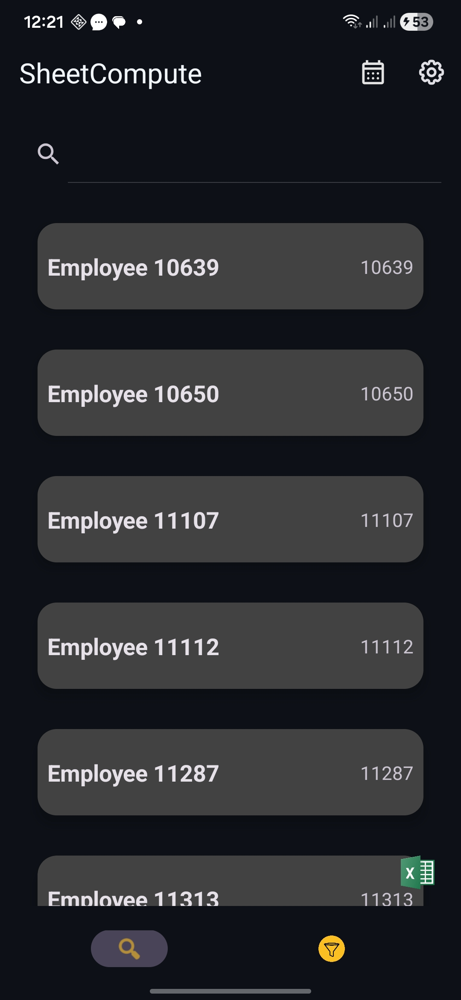
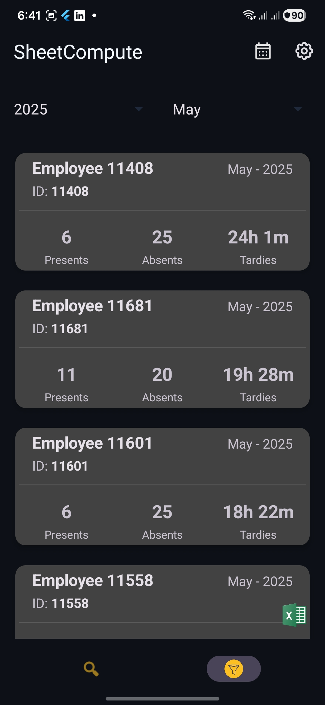
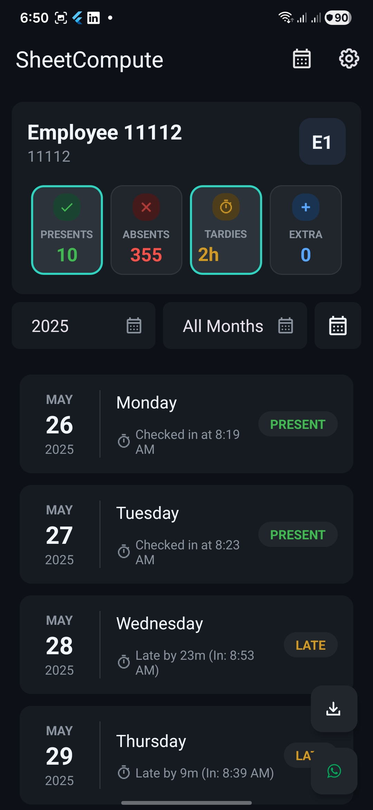
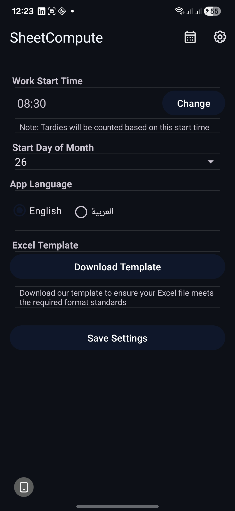
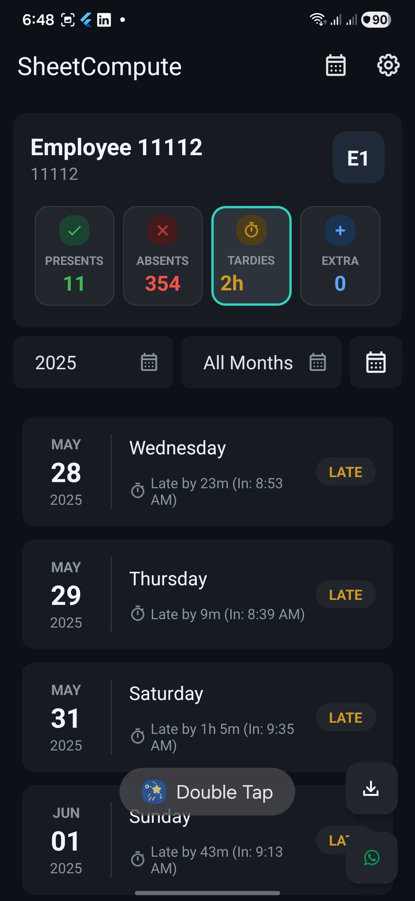

# Sheet Compute

Sheet Compute is a professional Android application designed to streamline employee attendance management and timesheet processing. It allows users to import attendance data from Excel files, calculate working hours and tardiness, and maintain a comprehensive local database of employee records and holidays.

## 📸 Screenshots

| Splash Screen | Search & Filter | Month Summary |
| :---: | :---: | :---: |
|  |  |  |

| Employee History | Settings | App Overview |
| :---: | :---: | :---: |
|  |  |  |

## 🚀 Key Features

- **Excel Processing**: Automated parsing and importing of `.xls` attendance files using Apache POI.
- **Attendance Management**: real-time tracking of clock-in times, automated tardiness calculation, and status monitoring.
- **Holiday Calendar**: Flexible management of company holidays with support for date ranges and weekend configurations.
- **Data Persistence**: Robust local storage utilizing Room Database with full Paging 3 integration.
- **History & Filtering**: Advanced search and filtering capabilities (month/year/employee) for historical attendance data.
- **Exporting**: Seamless export functionality to convert local records back into Excel format.
- **Feature Management**: Dynamic feature toggling via Firebase Remote Config.

## 🛠️ Technology Stack

- **Language**: Kotlin 2.2.0
- **UI Framework**: Material 3 with View Binding
- **Architecture**: MVVM + Clean Architecture (Data, Domain, UI layers)
- **Dependency Injection**: Hilt 2.57
- **Database**: Room 2.7.2
- **Asynchrony**: Coroutines & Flow
- **Navigation**: Jetpack Navigation Component
- **Excel Handling**: Apache POI (via `poi-android`)
- **Backend Integration**: Firebase Remote Config

## 🏗️ Architecture

The project follows a strict **Clean Architecture** pattern to ensure maintainability and testability:

- **Data Layer**: Contains Room entities, DAOs, repository implementations, and Paging sources.
- **Domain Layer**: Houses business logic, including Excel parsing algorithms, use cases (e.g., `CountWorkingDaysUseCase`), and Hilt DI modules.
- **UI Layer**: Organized by features (Attendance History, Employee Attendance, Holiday Calendar) containing Fragments, ViewModels, and Adapters.

## 📂 Project Structure

```text
app/src/main/java/com/example/sheetcompute/
├── data/           # Repository implementations and local storage (Room)
├── domain/         # Business logic, Excel parsing, and Use Cases
└── ui/             # Presentation layer organized by feature modules
```

## 🛠️ Getting Started

### Prerequisites
- **Android Studio**: Koala or later recommended.
- **JDK**: 11 or higher.
- **Android SDK**: Target API 35 (Min API 26).

### Building and Running
1. Clone the repository.
2. Open the project in Android Studio.
3. Sync Gradle and run the `:app` module.

### Common Gradle Commands
- **Assemble APK**: `./gradlew assembleDebug`
- **Run Unit Tests**: `./gradlew test`
- **Clean Project**: `./gradlew clean`
- **Linting**: `./gradlew :app:lintDebug`

## 🧪 Testing Guidelines

- **Unit Testing**: Required for all UseCases and ViewModels using JUnit 4 and MockK.
- **Assertions**: Use Google Truth for expressive assertions.
- **Coroutines**: Use `MainDispatcherRule` for reliable coroutine testing in ViewModels.

## 📄 License
This project is for internal employee management. Refer to the project owners for licensing details.
